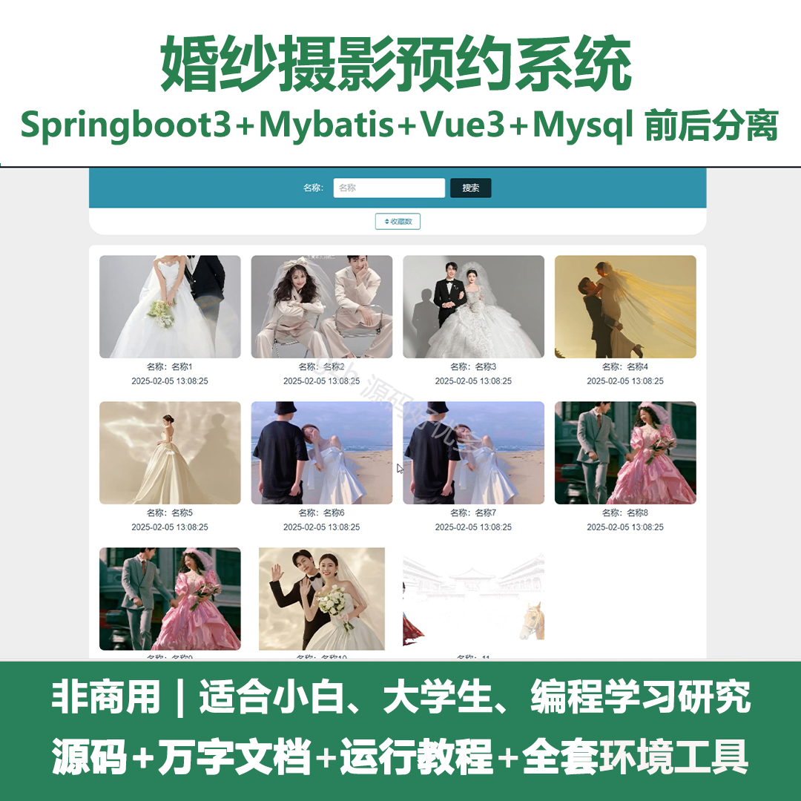
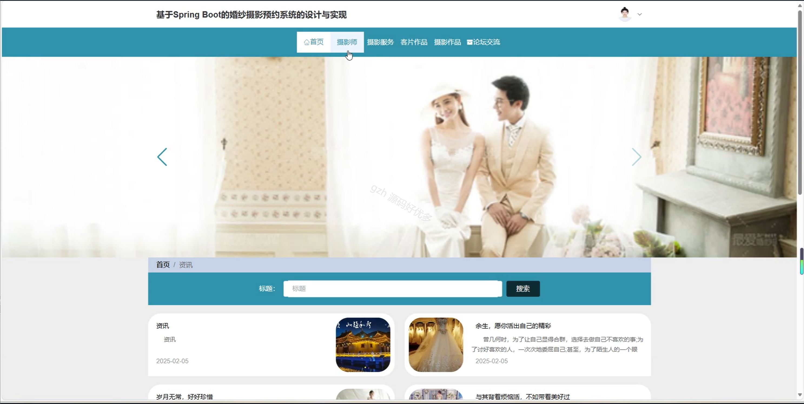
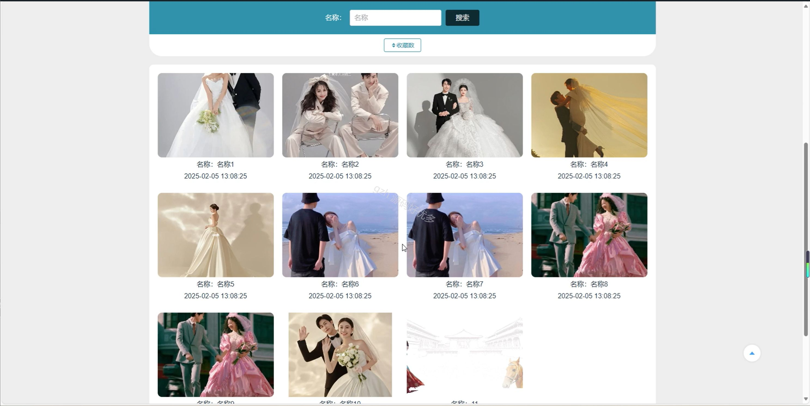
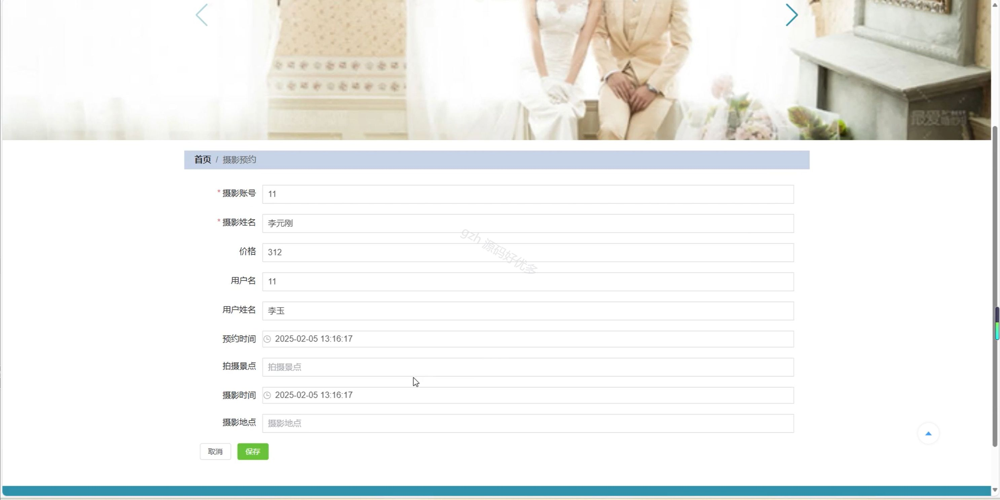
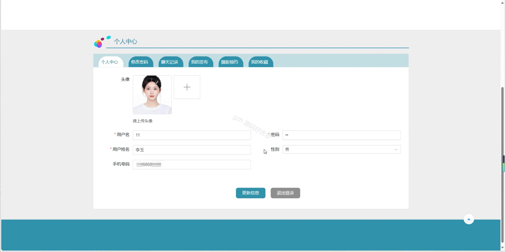
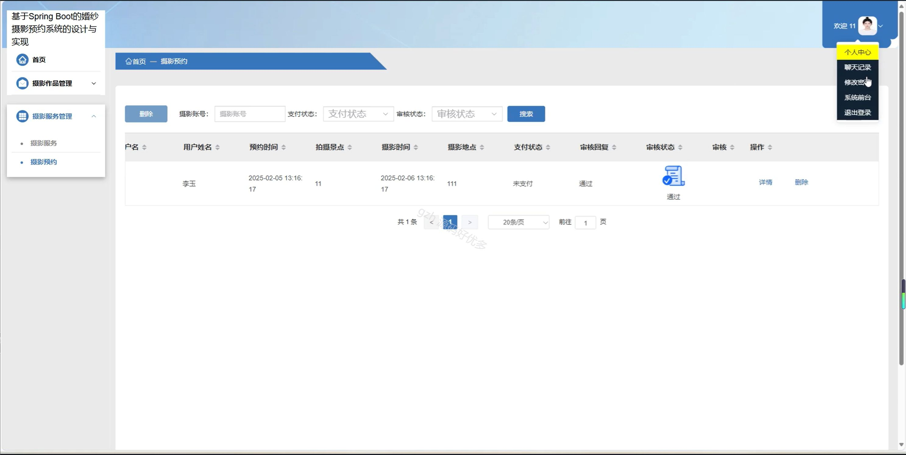
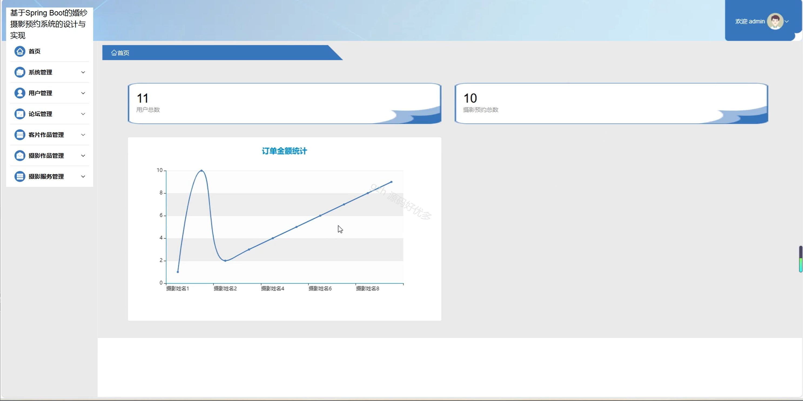
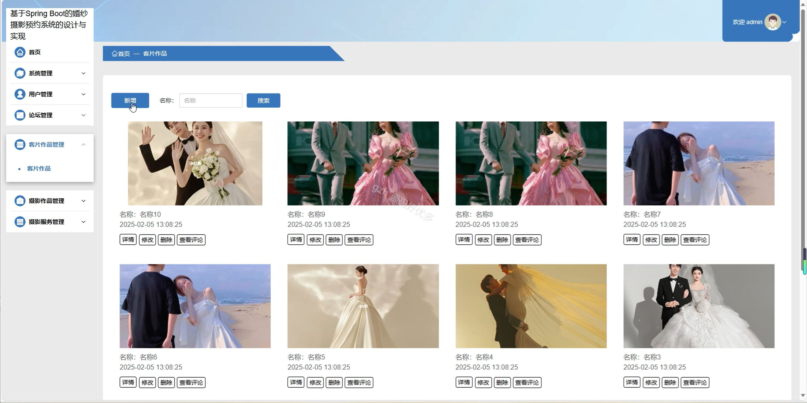
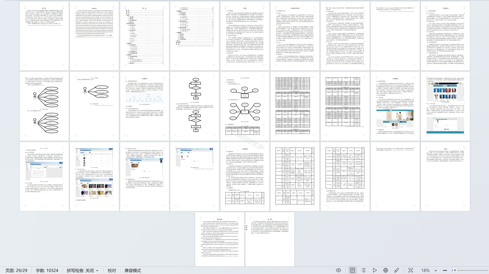

# springbootA272D
springbootA272D婚纱摄影预约系统+LW
 
## 查看主页获取源码

### 一、关键词
客片作品管理、摄影作品管理、影服务管理

### 二、作品包含
源码+数据库+设计文档万字+全套环境和工具资源+本地部署教程

### 三、项目技术
前端技术：Html、Css、Js、Vue3.0、Element-plus
后端技术：Java、SpringBoot3.0、MyBatis

### 四、运行环境（以下版本亲测，其他版本未知，请自测）
开发工具：IDEA/eclipse  + VSCODE

数据库：MySQL5.7（最低要5.7版本）

数据库管理工具：Navicat10以上版本

环境配置软件： JDK17 + Maven3.6.3

前端Nodejs：20

浏览器：谷歌浏览器

### 五、项目介绍
项目编号：springbootA272D

婚纱摄影预约系统可用于便捷实现婚纱摄影相关的预约、作品及服务管理等操作。

角色：管理员、用户、摄影师

管理员：首页、系统管理、用户管理、论坛管理、客片作品管理、摄影作品管理、摄影服务管理。

用户：首页、摄影师、摄影服务、客片作品、摄影作品、论坛交流、个人中心、修改密码、聊天记录、我的发布、摄影预约、我的收藏。

摄影师：首页、摄影作品管理、摄影服务管理。

### 六、运行截图

